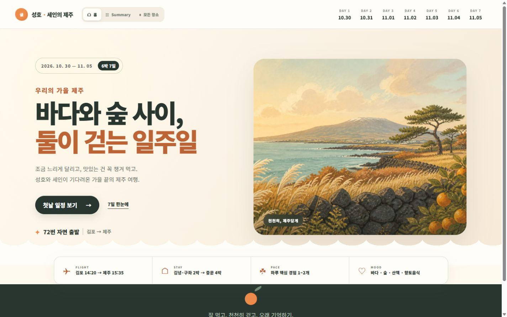
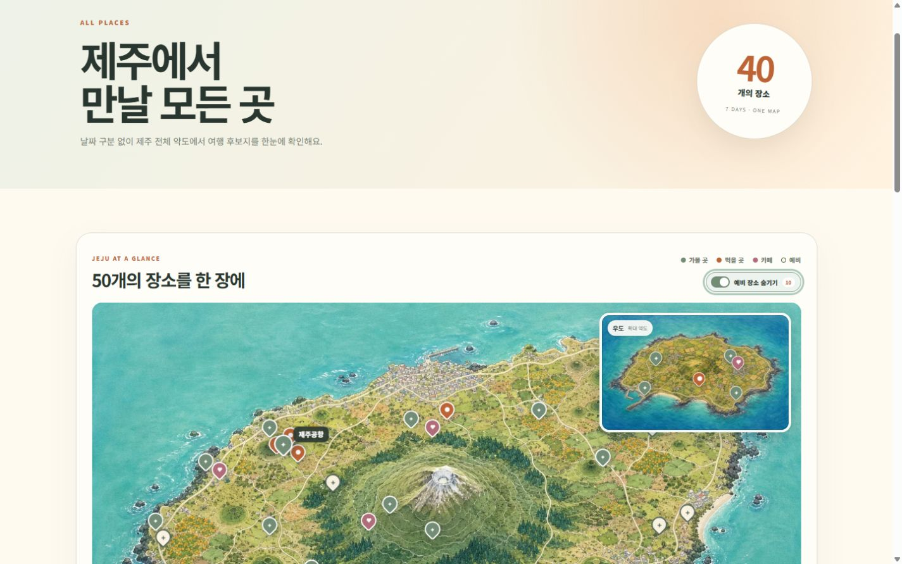
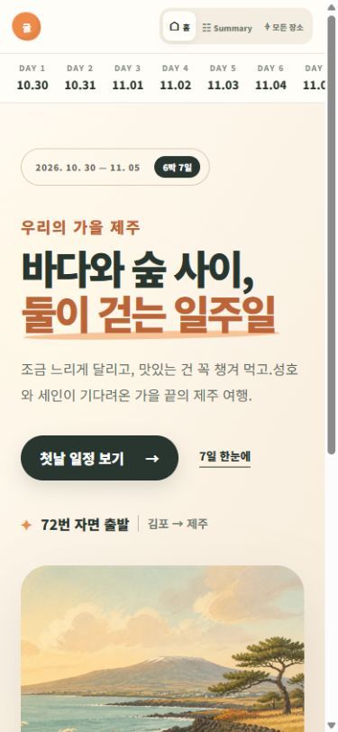
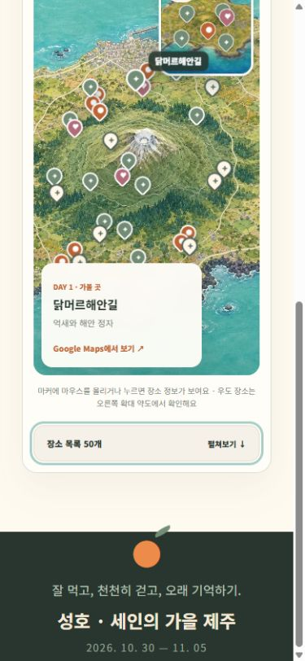
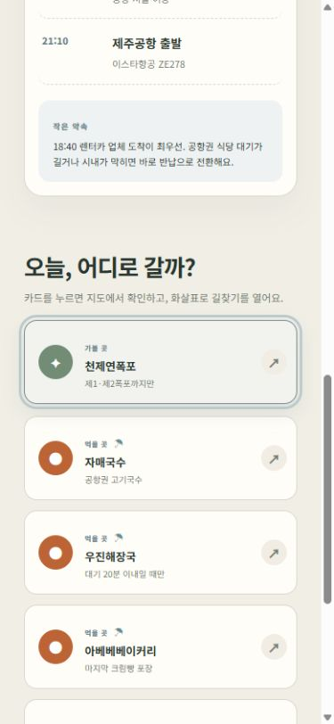
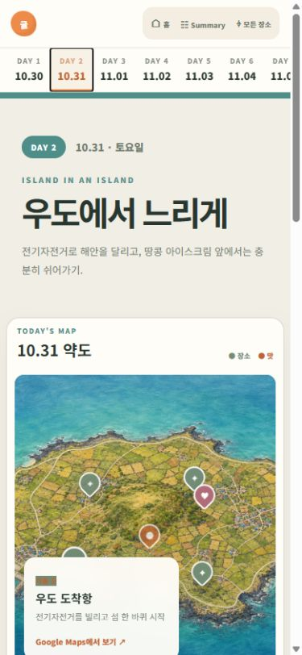
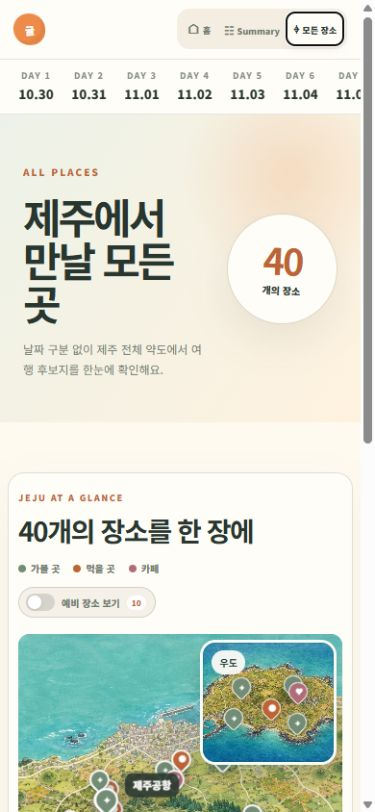

# 제주 여행 가이드 완성도 개선 보고서

- 점검일: 2026-08-19
- 대상: `https://newbieyond.github.io/my_history_jeju/`
- 로컬 환경: Vite 정적 빌드, Chromium 기반 인앱 브라우저

## 결과 요약

홈, Summary, Day 1~7, 모든 장소 화면을 PC·태블릿·모바일에서 점검했다. 모든 테스트 크기에서 문서 가로 넘침과 콘솔 오류가 없었고, 프로덕션 빌드가 정상 완료됐다.

| 구분 | 테스트 크기 | 결과 |
| --- | --- | --- |
| PC | 1440 × 900 | 통과 |
| 태블릿 | 768 × 1024 | 통과 |
| 모바일 | 390 × 844 | 통과 |

## 이번에 개선한 내용

1. 동일한 이름의 장소가 함께 선택되던 문제를 수정했다. Day 1과 Day 7의 `제주공항`은 이제 각각 독립적으로 강조된다.
2. 모바일 상단 메뉴에 홈·Summary·모든 장소 라벨을 표시하고 날짜 바의 노출 스크롤바를 제거했다.
3. 모바일 `모든 장소` 페이지의 40~50개 카드 목록을 접을 수 있게 했다. 기본 문서 높이는 약 5,500px에서 약 1,550px로 줄었다.
4. 예비 장소 토글과 목록 펼치기를 함께 사용할 때 지도 마커와 카드 수가 40개에서 50개로 정확히 갱신되도록 확인했다.
5. PNG 이미지를 WebP로 변환하고 사용하지 않는 이미지를 제거했다. 공개 이미지 총량은 13,031,964바이트에서 1,095,650바이트로 약 91.6% 감소했다.
6. 대표 이미지 크기를 명시하고 지도 이미지는 지연 로딩하도록 했다. 선택된 지도 마커는 보조기기에도 상태가 전달된다.
7. `prefers-reduced-motion`을 적용해 모션 축소 설정을 사용하는 기기에서 애니메이션을 최소화했다.

## 상호작용 회귀 테스트

- 홈 → Summary → 날짜 상세 → 모든 장소 이동
- Summary의 7개 일정 카드 표시
- 추천 흐름 선택 시 해당 지도 마커와 장소 카드 동기화
- 장소 카드 본문 선택과 Google Maps 화살표 링크 분리
- Day 2 우도 전용 약도 표시
- 모든 장소 지도 40개 마커 및 예비 장소 포함 50개 마커 표시
- 예비 장소 토글, 모바일 장소 목록 펼치기/접기
- Day 7 `천제연폭포` 선택 시 단일 마커만 활성화
- 모든 화면에서 가로 넘침 없음
- 브라우저 콘솔 경고·오류 없음

## 빌드 결과

```text
dist/index.html                  0.63 kB (gzip 0.41 kB)
dist/assets/index-*.css        34.17 kB (gzip 8.02 kB)
dist/assets/index-*.js        217.15 kB (gzip 68.89 kB)
✓ built successfully
```

## 커밋 이력

- `3bfc286` PC 지도 선택 상태와 중복 장소 처리 개선
- `e8e68bc` 모바일 내비게이션과 장소 목록 길이 개선
- `6cc07f8` 이미지 용량과 모션 접근성 최적화
- 최종 QA 화면과 이 보고서는 별도 커밋으로 기록

## 최종 화면

### PC 홈



### PC 모든 장소



### 모바일 홈



### 모바일 모든 장소



### 모바일 일정 카드



## 후속 개선: 모바일 약도 폭

- 390px 화면에서 중첩된 바깥 여백과 카드 패딩을 줄였다.
- 일정 약도와 전체 약도의 실제 지도 폭이 285px에서 337px로 약 18% 넓어졌다.
- 지도 카드 외곽은 좌우 8px, 지도 이미지는 좌우 19px 지점까지 확장된다.
- 제목·추천 흐름·장소 카드의 여백은 유지했고 문서 가로 넘침은 발생하지 않았다.





## 남은 운영 참고사항

- 날씨, 배편, 관광지 운영시간은 외부 사이트의 최신 정보를 여는 방식이며 사이트 내부 데이터로 자동 갱신하지 않는다.
- 배포 후 브라우저 캐시 때문에 이전 이미지가 잠시 보이면 강력 새로고침으로 최신 정적 파일을 받을 수 있다.
